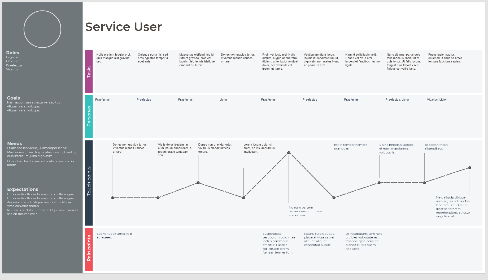

# xd-user-journey
XD plugin to create initial layout of user journey from CSV file
This plugin loads in user journey text from a CSV file and renders the different journey stages

## Data
The CSV should be arranged in the following way (see sample CSV for details):
The fist column is the row title, with entries in the following cells for that topic
row 1: Persona
row 2: Roles
row 3: Goals
row 4: Needs
row 5: Expectations

This data is used to populate the side-bar of the diagram

Rows 6-11 are for the actual steps along the journey:
row 6: Tasks
row 7: Persona
row 8: Emotion
row 9: Touch points
row 10: Pain points

It is intended that common graphics are used for the personas, with multiple artboards used for each persona in the service.

## To do
* Automatically re-size the artboard based on the length of the user journey
* Use custom emoticons for the emotions in the journey
* Structure the generated drawing to improve editing
* Format the side panel text with bullet lists

## Example screenshot

